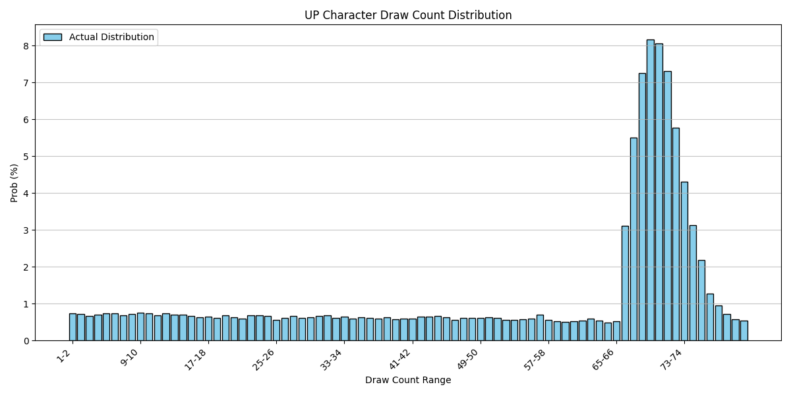
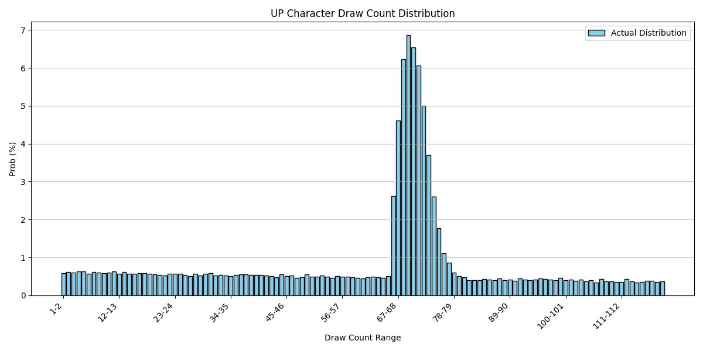

# 终末地卡池 | Endfield Gacha

**文 / A**：[**中文**](README.md "中文版自述文档") | [**English**](README_en.md "English version readme document")

---

## 终末地卡池

《明日方舟：终末地》的卡池系统，包括但不限于统计、模拟。

## 目录

- [项目介绍](#项目介绍 "项目介绍")

- [说明](#说明 "说明")

- [统计结论](#统计结论 "统计结论")

- [更新计划](#更新计划 "更新计划")

- [致谢](#致谢 "致谢")

---

## 项目介绍

### 1. 环境要求

- **Python** 3.10+ （编写使用3.14.2）

- 依赖库：
      - matplotlib 3.10.8 （统计绘图）
      - rich 14.3.2 （终端美化）
      - tqdm 4.67.3 （进度显示）

### 2. 安装步骤

#### 2.1 克隆仓库

```bash
git clone https://github.com/ArsvineZhu/EndfieldGacha.git
cd EndfieldGacha
```

#### 2.2 安装依赖

```bash
pip install -r requirements.txt
```

### 3. 项目结构

```plaintext
EndfieldGacha/
├── config/                   # 配置文件目录
│   ├── char_pool.json        # 角色卡池配置
│   ├── constants.json        # 常量数值配置
│   ├── gacha_rules.json      # 卡池规则配置
│   └── weapon_pool.json      # 武器卡池配置
├── pic/                      # 图片存储目录
│   ├── char.png              # 角色卡池规则原图
│   ├── weapon.png            # 武器卡池规则原图
│   └── stats/                # 统计结果图片存储目录
├── client.py                 # 控制台客户端
├── core.py                   # 卡池系统核心
└── demo.py                   # 演示与统计
```

---

## 说明

部分图片素材来自于 **《明日方舟：终末地》** 游戏截图。

游戏内卡池机制[介绍原文](doc/mechanics.md "游戏卡池机制介绍")。

部分规则在官方的卡池介绍中 **没有详细说明**，因此在开发过程中，我对以下内容进行了 **合理假设**：

### 一、十连保底机制

在角色池中存在“**每十次抽取必定获得5★及以上干员**”的机制，但在那个必定“出5★及以上干员”的一抽中，5★与6★的概率分布没有说明，因此我认为有两种假设：

#### （1）五星挤占四星概率，六星基础概率不变（当前）

e.g. 新卡池的第一次十连，前 9 抽无 5★ 及以上干员，则第十抽的概率分布为：

```plaintext
6★： 0.80%
5★：91.20%
4★：00.00%
```

e.g. 抽取中途的卡池，前 68 抽无 6★ 干员，且前 9 抽无 5★ 干员，则下一抽（第69抽）的概率分布为：

```plaintext
6★：20.80%
5★：79.20%
4★： 0.00%
```

> **规则**：前 65 抽未出 6★ 干员，则从第66抽起，每抽的 6★ 概率增加 5%，直至第 80 抽必出 6★ 干员（小保底 / 软保底）

#### （2）五星与六星总概率视作1，按比例重新映射（舍弃）

e.g. 新卡池的第一次十连，前 9 抽无 5★ 及以上干员，则第十抽的概率分布为：

```plaintext
6★：~ 0.91% <- 0.8% / (0.8% + 8%)
5★：~90.91% <- 8% / (0.8% + 8%)
4★：  0.00%
```

e.g. 抽取中途的卡池，前 68 抽无 6★ 干员，且前 9 抽无 5★ 干员，则下一抽（第69抽）的概率分布为：

```plaintext
6★：~72.22% <- 20.8% / (20.8% + 8%)
5★：~27.78% <- 8% / (20.8% + 8%)
4★：  0.00%
```

由此看出第二种假设“五星与六星总概率视作1，按比例重新映射”明显**不符合实际体验**~~且与游戏厂家设计意图相悖~~，故此舍弃。

同理，武器池也适用第一种假设解决十连保底问题。

### 二、六星概率提升机制（小保底 / 软保底）

角色卡池中有规则：“前 65 抽未出 6★ 干员，则从第66抽起，每抽的**6★ 概率增加 5%**，直至第 80 抽必出 6★ 干员。”此表述未说明 6★ 概率提升后，5★ 与 4★ 出率如何分布，故此有两种假设：

#### （1）六星挤占其余星级概率

e.g. 抽取中途的卡池，前 68 抽无 6★ 干员，且前 9 抽存在 5★ 干员（不触发十连保底），则下一抽（第69抽）的概率分布为：

```plaintext
6★：20.80%
5★： 8.00%
4★：71.20% （末尾被截断）
```

当抽数更多时：

```plaintext
6★：80.80%
5★： 8.00%
4★：11.20% （末尾被截断）
```

进一步地：

```plaintext
6★：95.80%
5★： 4.20% （末尾被截断）
4★： 0.00% （截断）
```

这种假设会使得抽数提升后，5★ 与 4★ 的比例失调。但是由于缺乏数据支撑，我无法知晓在 65-80 抽之间抽出 5★ 与 4★ 的比例如何、现实是否符合此假设。

> **前提**：优先挤占 4★ 的概率，总不能先占 5★ 的概率吧，不能吧？

#### （2）五星与四星总概率视作1，按比例重新映射（暂定）

e.g. 抽取中途的卡池，前 68 抽无 6★ 干员，且前 9 抽存在 5★ 干员（不触发十连保底），则下一抽（第69抽）的概率分布为：

```plaintext
6★： 20.80%
5★：~ 6.38% <- 8% * (1 - 20.80%) / (8% + 91.2%)
4★：~72.81% <- 91.2% * (1 - 20.80%) / (8% + 91.2%)
```

此假设保持抽出 5★ 与 4★ 的比例不变，更有可能是实际使用的方案。

由于缺乏数据支撑，难以看出哪一种假设不符合实际体验，**只能暂定使用第二种**。

---

## 统计结论

以下统计结果来自 `demo.py` 的模拟结果，若无特别说明，模拟规模均为 10 万次。

### （1） 在一个角色池中，抽中UP角色时所需的抽数

以下是概率分布：


**结论**：平均抽中 UP 角色所需抽数为 **81.57** 抽

- 1-65（提前金）：22.70%
- 66-80（小保底）：33.09% （约 1/3）
- 81-119：10.08%
- 120-120（大保底）：34.13% （约 1/3）

~~120大保底概率一骑绝尘！擎天柱吗这是？~~

> 注：【加急招募】送的 10 抽未使用，不计入。

### （2）在一个武器池中，抽中UP武器时所需的抽数

以下是概率分布：


**结论**：平均抽中 UP 武器所需抽数为 **55.49** 抽（5 ~ 6 次申领）

- 10-20: 9.62%
- 20-30: 8.60%
- 30-40: 7.72%
- 40-50: 11.95% *
- 50-60: 7.12%
- 60-70: 6.31%
- 70-80: 5.71%
- 80-90: 42.95% *

> \* 3 次申领未出 6 星武器，则第 4 次必出 6 星武器
> \* 7 次申领未出 UP 武器，则第 8 次必出 UP 武器

### （3）在一个角色池中，最多抽到小保底（80抽）查看抽出UP角色的期望抽数

以下是概率分布：



**结论**：平均抽中 UP 角色所需抽数为 **54.75** 抽

> 注：【加急招募】送的 10 抽未使用，不计入。

### （4）在一个角色池中，最多抽到119抽，查看抽出UP角色的期望抽数

以下是概率分布：



**结论**：平均抽中 UP 角色所需抽数为 **61.46** 抽

> 注：【加急招募】送的 10 抽未使用，不计入。

### （5）在一个角色池中，抽到120抽，查看获得武库配额的数量

以下是概率分布：


**结论**：角色池获得的武库配额分布近似正态分布，均值为 **9411**，标准差为 **1591**

> 注：【加急招募】送的 10 抽未使用，不计入。

### （6）在一个武器池中，8次武器池申领获得的集成配额数量

以下是概率分布：


**结论**：8次武器池申领获得的集成配额数量分布近似正态分布，均值为 **391**，标准差为 **71**

### （7）120抽角色池的角色数量及概率分布

以下是概率分布：


**结论**：120抽角色池的6星角色数量分布近似正态分布，均值为 **2.09**，标准差为 **0.80**

各星级角色出率：

- 4星：84.98%
- 5星：13.27%
- 6星：1.74% (UP = 0.87%)

> 注：【加急招募】送的 10 抽未使用，不计入。

### （8）8次武器池申领武器数量及概率分布

以下是概率分布：


**结论**：8次武器池申领的6星武器数量分布近似正态分布，均值为 **4.02**，标准差为 **1.44**

各星级角色出率：

- 4星：79.11%
- 5星：15.87%
- 6星：5.02% (UP = 1.255%)

---

## 更新计划

我开发此项目为兴趣使然，本人技术能力有限，如有差错请不吝赐教。

### 更新日志

#### 2026年2月9日 1.0.0 基本稳定版本发布

### 未来计划

#### 控制台客户端拟真更新

- 支持读取历史抽卡记录
- 支持导入已有角色
- 支持获取重复角色的信物，可兑换为【保障配额】或【终点配额】

---

## 致谢

- **上海鹰角网络科技有限公司**

- **《明日方舟：终末地》**

- ~~给我出馊主意的~~迷迭香厨、白毛猫娘：**宁宁**

- 和我一起讨论的老牌舟友：**LoyaLTY**

- 所有支持我、给予我灵感的开发者、视频创作者

> **注**：以上排名不分先后

---

> （注：文档及代码部分内容可能由 AI 生成）
