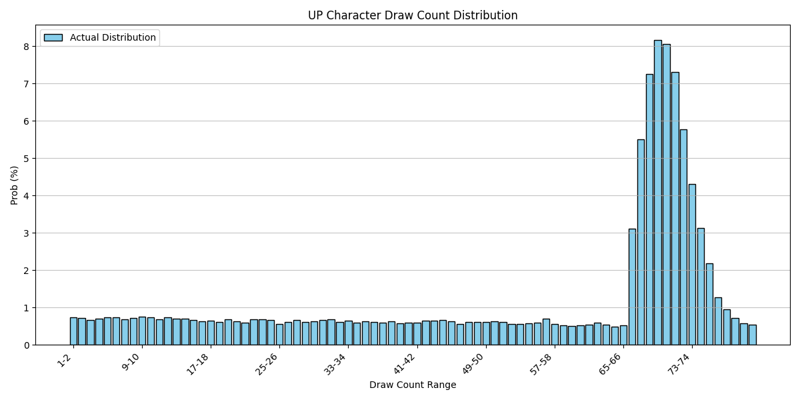
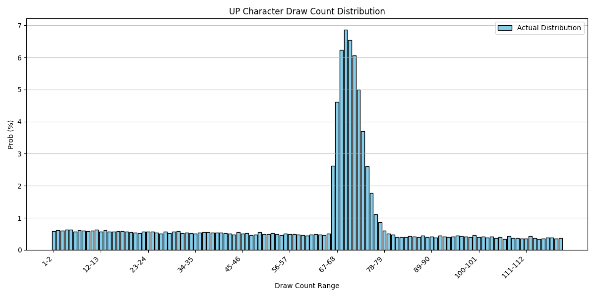

# 终末地卡池 | Endfield Gacha

**文 / A**：[**中文**](README.md "中文版自述文档") | [**English**](README_en.md "English version readme document")

---

## 终末地卡池

《明日方舟：终末地》的寻访与申领系统，包括但不限于统计、模拟。

## 目录

- [项目介绍](#项目介绍 "项目介绍")

- [技术架构详解](#技术架构详解 "技术架构详解")

- [快速入门指南](#快速入门指南 "快速入门指南")

- [说明](#说明 "说明")

- [统计结论](#统计结论 "统计结论")

- [开发者指南](#开发者指南 "开发者指南")

- [更新日志](#更新日志 "更新日志")

- [致谢](#致谢 "致谢")

---

## 项目介绍

### 1. 环境要求

- **Python** 3.10+ （编写使用3.14.2）

- 依赖库（完整列表见 pyproject.toml / uv.lock）：
      - Flask, Flask-Cors, waitress （Web服务）
      - numpy （核心计算）
      - rich （终端美化与进度显示）
      - matplotlib, pillow, scipy （统计绘图与分析）
      - tqdm （进度显示）

### 2. 安装步骤

#### 2.1 克隆仓库

```bash
git clone https://github.com/ArsvineZhu/EndfieldGacha.git
cd EndfieldGacha
```

#### 2.2 安装依赖

```bash
uv sync
```

### 3. 项目结构

```plaintext
EndfieldGacha/
├── run.py                   # 统一入口（推荐）
├── core.py                  # 核心抽卡逻辑
├── server.py                # Web 服务
├── scheduler/               # 策略调度包
│   ├── engine.py           # 调度器主逻辑
│   ├── strategy_v2.py      # 结构化策略规则
│   ├── strategy_protocol.py# structured JSON 协议
│   ├── scoring.py          # 资源与评分系统
│   └── workers.py          # 多进程 worker
├── tools/                   # 可运行工具
│   ├── demo.py             # 抽卡演示与统计
│   ├── evaluation.py       # 策略评估
│   └── examination.py      # 概率分布验证
├── configs/                 # 配置文件目录
├── app/                     # Web 应用
├── test/                    # 测试用例
├── doc/                     # 文档
├── pic/                     # 图片资源
├── start.ps1                # Windows 启动脚本
├── AGENTS.md                # AI 助手索引
└── ref.md                   # 开发者参考
```

**快速运行**：

- `uv run run.py` — 显示帮助
- `uv run run.py demo` — 抽卡演示
- `uv run run.py eval` — 策略评估
- `uv run run.py exam` — 概率验证
- `uv run run.py server` — 启动 Web 服务

---

## 技术架构详解

### 项目整体架构

EndfieldGacha 采用模块化分层架构设计，各层职责清晰，便于维护和扩展：

#### 核心层 (`core.py`)

- **BatchRandom**: 批量随机数生成器（支持种子复现）
- **GachaResult**: 抽卡结果数据类（名称、星级、配额、保底标记）
- **GlobalConfigLoader**: 全局配置加载器（单例模式）
- **CharGacha**: 角色卡池类（6星概率递增、UP保底120抽、6星保底80抽、5星保底10抽）
- **WeaponGacha**: 武器卡池类（申领式抽卡、最后1抽替换机制）

#### 服务层 (`server.py`)

- Flask Web服务器，提供完整的用户管理系统
- 基于IP和User-Agent生成唯一用户ID，数据存储在`users/`目录
- 支持角色/武器抽卡、充值、兑换、历史记录等完整功能

#### 策略层 (`scheduler/` 包)

- **StrategyRuleSet / StrategyRuleEngine**: 结构化策略系统（支持嵌套布尔规则组）
- **ScoringSystem**: V2 科学评分系统（目标、收益、资源、风险四模块）
- **Scheduler**: 策略调度器，支持多卡池连续模拟、批量并行评估和多策略对比分析
- **ScoringPreferences / StrategyGoal / StrategyTrace / StrategyScoreReport**: V2 评分偏好、目标、轨迹与报告数据结构

#### 工具层 (`tools/` 包)

- **`demo.py`**: 抽卡演示与统计工具（提供丰富的统计分析功能）
- **`evaluation.py`**: 策略评估脚本（预置多种抽卡策略对比）
- **`examination.py`**: 概率分布验证工具

#### 前端层 (`app/`目录)

- **templates/**: HTML模板文件
- **static/**: 压缩后的CSS、JS、图片资源
- **utils/compress.py**: 静态资源压缩和混淆工具

#### 数据层

- **configs/**: 多套卡池配置（config_1 到 config_7）
- **users/**: 用户数据存储（JSON格式）
- **pic/**: 图片资源文件
- **doc/**: 游戏机制说明文档

### 模块依赖关系

```plaintext
┌─────────────────┐    ┌─────────────────┐    ┌─────────────────┐
│   server.py     │    │  scheduler/     │    │   tools/        │
│   (Web服务)     │◄──►│  (策略调度)     │◄──►│   (演示工具)    │
└────────┬────────┘    └────────┬────────┘    └────────┬────────┘
         │                      │                      │
         ▼                      ▼                      ▼
┌─────────────────────────────────────────────────────────────┐
│                     core.py (核心逻辑)                       │
│   ┌───────────┬───────────┬───────────┬───────────┐        │
│   │BatchRandom│GachaResult│ConfigLoader│CharGacha │        │
│   └───────────┴───────────┴───────────┴───────────┘        │
└─────────────────────────────────────────────────────────────┘
         │                      │                      │
         ▼                      ▼                      ▼
┌─────────────────┐    ┌─────────────────┐    ┌─────────────────┐
│   configs/      │    │   users/        │    │   app/static    │
│   (配置文件)    │    │   (用户数据)    │    │   (前端资源)    │
└─────────────────┘    └─────────────────┘    └─────────────────┘
```

## 快速入门指南

### 1. 启动Web服务（推荐）

```bash
# 使用统一入口（推荐）
uv run run.py server

# 或使用启动脚本（Windows）
.\start.ps1

# 或直接运行
uv run server.py
```

服务启动后，访问 <http://localhost:5000> 即可使用完整的Web界面进行抽卡模拟。

### 2. 使用演示工具进行统计分析

```bash
uv run run.py demo
# 或
uv run python -m tools.demo
```

演示工具提供以下主要功能：

- `demo_char_draw()`: 角色卡池抽卡示例
- `stats_char_up_prob()`: 统计UP角色所需抽数
- `stats_char_quota()`: 统计120抽角色池配额分布
- `stats_char_potential()`: 统计角色满潜所需抽数

### 3. 执行策略评估

```bash
uv run run.py eval
# 或
uv run python -m tools.evaluation
```

策略评估脚本预置了多种抽卡策略，可对比不同策略的效率和评分。

### 4. 核心模块调用示例

```python
# 角色卡池单抽
from core import CharGacha, GlobalConfigLoader
config = GlobalConfigLoader("configs/config_1")
gacha = CharGacha(config, size=1024)
result = gacha.attempt()  # 返回 GachaResult 对象

# 武器卡池申领
from core import WeaponGacha
weapon_gacha = WeaponGacha(config, size=1024)
results = weapon_gacha.attempt()  # 返回 GachaResult 列表（通常10个）
```

### 5. 配置文件说明

项目支持多套配置，默认使用 `configs/config_1/` 目录下的配置文件：

- `char_pool.json`: 角色卡池数据
- `weapon_pool.json`: 武器卡池数据  
- `gacha_rules.json`: 抽卡规则配置
- `constants.json`: 全局常量配置

---

## 说明

部分图片素材来自于 **《明日方舟：终末地》** 游戏截图。

游戏内寻访与申领机制[介绍原文](doc/mechanics.md "游戏寻访与申领机制介绍")。

部分规则在官方的寻访与申领介绍中 **没有详细说明**，因此在开发过程中，我对以下内容进行了 **合理假设**：

### 一、十连保底机制

在特许寻访中存在“**每十次寻访必定获得5★及以上干员**”的机制，但在那个必定“出5★及以上干员”的一次寻访中，5★与6★的概率分布没有说明，因此我认为有两种假设：

#### （1）五星挤占四星概率，六星基础概率不变（当前）

e.g. 新开启的特许寻访的第一次十连寻访，前 9 次寻访无 5★ 及以上干员，则第十次寻访的概率分布为：

```plaintext
6★： 0.80%
5★：91.20%
4★：00.00%
```

e.g. 寻访中途的特许寻访，前 68 次寻访无 6★ 干员，且前 9 次寻访无 5★ 干员，则下一次寻访（第69次寻访）的概率分布为：

```plaintext
6★：20.80%
5★：79.20%
4★： 0.00%
```

> **规则**：前 65 次寻访未出 6★ 干员，则从第66次寻访起，每次寻访的 6★ 概率增加 5%，直至第 80 次寻访必出 6★ 干员（小保底 / 软保底）

#### （2）五星与六星总概率视作1，按比例重新映射（舍弃）

e.g. 新开启的特许寻访的第一次十连寻访，前 9 次寻访无 5★ 及以上干员，则第十次寻访的概率分布为：

```plaintext
6★：~ 0.91% <- 0.8% / (0.8% + 8%)
5★：~90.91% <- 8% / (0.8% + 8%)
4★：  0.00%
```

e.g. 寻访中途的特许寻访，前 68 次寻访无 6★ 干员，且前 9 次寻访无 5★ 干员，则下一次寻访（第69次寻访）的概率分布为：

```plaintext
6★：~72.22% <- 20.8% / (20.8% + 8%)
5★：~27.78% <- 8% / (20.8% + 8%)
4★：  0.00%
```

由此看出第二种假设“五星与六星总概率视作1，按比例重新映射”明显**不符合实际体验**~~且与游戏厂家设计意图相悖~~，故此舍弃。

同理，武库申领的“一次申领（10 连）保底至少 1 件 5★及以上武器”机制，同样适用第一种假设。

### 二、六星概率提升机制（小保底 / 软保底）

特许寻访中有规则：“前 65 次寻访未出 6★ 干员，则从第66次寻访起，每次寻访的**6★ 概率增加 5%**，直至第 80 次寻访必出 6★ 干员。”此表述未说明 6★ 概率提升后，5★ 与 4★ 出率如何分布，故此有两种假设：

#### （1）六星挤占其余星级概率

e.g. 寻访中途的特许寻访，前 68 次寻访无 6★ 干员，且前 9 次寻访存在 5★ 干员（不触发十连保底），则下一次寻访（第69次寻访）的概率分布为：

```plaintext
6★：20.80%
5★： 8.00%
4★：71.20% （末尾被截断）
```

当抽数更多时：

```plaintext
6★：80.80%
5★： 8.00%
4★：11.20% （末尾被截断）
```

进一步地：

```plaintext
6★：95.80%
5★： 4.20% （末尾被截断）
4★： 0.00% （截断）
```

这种假设会使得寻访次数提升后，5★ 与 4★ 的比例失调。但是由于缺乏数据支撑，我无法知晓在 65-80 次寻访之间获取 5★ 与 4★ 的比例如何、现实是否符合此假设。

> **前提**：优先挤占 4★ 的概率，总不能先占 5★ 的概率吧，不能吧？

#### （2）五星与四星总概率视作1，按比例重新映射（暂定）

e.g. 寻访中途的特许寻访，前 68 次寻访无 6★ 干员，且前 9 次寻访存在 5★ 干员（不触发十连保底），则下一次寻访（第69次寻访）的概率分布为：

```plaintext
6★： 20.80%
5★：~ 6.38% <- 8% * (1 - 20.80%) / (8% + 91.2%)
4★：~72.81% <- 91.2% * (1 - 20.80%) / (8% + 91.2%)
```

此假设保持获取 5★ 与 4★ 的比例不变，更有可能是实际使用的方案。

由于缺乏数据支撑，难以看出哪一种假设不符合实际体验，**只能暂定使用第二种**。

---

## 统计结论

以下统计结果来自 `demo.py` 的模拟结果，若无特别说明，模拟规模均为 10 万次。

### （1） 在一次特许寻访中，获取概率提升干员时所需的寻访次数

以下是概率分布：


**结论**：平均获取概率提升干员所需寻访次数为 **81.57** 次

- 1-65（提前金）：22.70%
- 66-80（小保底）：33.09% （约 1/3）
- 81-119：10.08%
- 120-120（大保底）：34.13% （约 1/3）

~~120大保底概率一骑绝尘！擎天柱吗这是？~~

> 注：【加急招募】赠送的 10 次寻访未使用，不计入。

### （2）在一次武库申领中，获取概率提升武器时所需的申领次数

以下是概率分布：


**结论**：平均获取概率提升武器所需申领次数为 **55.49** 次（约 5 ~ 6 次申领）

- 10-20: 9.62%
- 20-30: 8.60%
- 30-40: 7.72%
- 40-50: 11.95% *
- 50-60: 7.12%
- 60-70: 6.31%
- 70-80: 5.71%
- 80-90: 42.95% *

> \* 3 次申领未获取 6 星武器，则第 4 次必出 6 星武器
> \* 7 次申领未获取概率提升武器，则第 8 次必出概率提升武器

### （3）在一次特许寻访中，最多寻访至小保底（80次）查看获取概率提升干员的期望寻访次数

以下是概率分布：



**结论**：平均获取概率提升干员所需寻访次数为 **54.75** 次

> 注：【加急招募】赠送的 10 次寻访未使用，不计入。

### （4）在一次特许寻访中，最多寻访至119次，查看获取概率提升干员的期望寻访次数

以下是概率分布：



**结论**：平均获取概率提升干员所需寻访次数为 **61.46** 次

> 注：【加急招募】赠送的 10 次寻访未使用，不计入。

### （5）在一次特许寻访中，寻访至120次，查看获取武库配额的数量

以下是概率分布：


**结论**：特许寻访获取的武库配额分布近似正态分布，均值为 **9411**，标准差为 **1591**

> 注：【加急招募】赠送的 10 次寻访未使用，不计入。

### （6）在一次武库申领中，8次申领获取的集成配额数量

以下是概率分布：


**结论**：8次武库申领获取的集成配额数量分布近似正态分布，均值为 **391**，标准差为 **71**

### （7）120抽角色池的角色数量及概率分布

以下是概率分布：


**结论**：120次特许寻访的6星干员数量分布近似正态分布，均值为 **2.09**，标准差为 **0.80**

各星级角色出率：

- 4星：84.98%
- 5星：13.27%
- 6星：1.74% (UP = 0.87%)

> 注：【加急招募】赠送的 10 次寻访未使用，不计入。

### （8）8次武库申领的武器数量及概率分布

以下是概率分布：


**结论**：8次武库申领获取的6星武器数量分布近似正态分布，均值为 **4.02**，标准差为 **1.44**

各星级武器出率：

- 4星：79.11%
- 5星：15.87%
- 6星：5.02% (UP = 1.255%)

### （9）加急招募获得武库配额数量分布

以下是概率分布：


**结论**：加急招募的 10 连寻访获得武库配额数量均值为 **571**

---

## 开发者指南

### 扩展开发

#### 系统扩展说明

**注意**：本系统已经稳定，**不再添加新的卡池类型**。当前仅支持角色卡池和武器卡池两种类型，符合《明日方舟：终末地》游戏机制。

#### 自定义策略

使用结构化规则定义新策略：

```python
from scheduler import Scheduler, StrategyCondition, StrategyRuleSet


def custom_strategy():
    scheduler = Scheduler(config_dir="configs", arrange="arrange1")
    scheduler.banner(
        StrategyRuleSet(
            match="all",
            conditions=[
                StrategyCondition(kind="draws", operator=">=", value=50),
                StrategyCondition(kind="resource_left", operator=">=", value=20),
            ],
            tags=["custom-structured-strategy"],
        ),
        name="config_3",
    )
    scheduler.evaluate(scale=10000, workers=8)
```

#### 界面定制

1. 修改`app/templates/index.html`前端模板
2. 更新`app/static/`中的CSS和JS文件
3. 运行`uv run python app/utils/compress.py`压缩静态资源

### API参考

#### Web服务API接口

| 接口路径 | 方法 | 功能描述 | 参数 |
| --------- | ------ | --------- | ------ |
| `/api/gacha` | POST | 执行抽卡 | `pool_type`, `count` |
| `/api/urgent_recruitment` | POST | 加急招募抽卡 | 无 |
| `/api/rewards` | GET | 获取累计奖励 | `pool_type` |
| `/api/user_data` | GET | 获取用户数据 | 无 |
| `/api/clear_data` | POST | 清空用户数据 | 无 |
| `/api/recharge` | POST | 充值操作 | `amount` |
| `/api/exchange` | POST | 资源兑换 | `from`, `to`, `amount` |
| `/api/history` | GET | 获取历史记录 | `pool_type` |
| `/api/pool_info` | GET | 获取卡池信息 | `pool_type` |

#### 核心模块关键方法

- `CharGacha.attempt()`: 角色卡池单次抽卡
- `WeaponGacha.attempt()`: 武器卡池单次申领
- `StrategyRuleEngine.should_stop()`: 检查结构化策略条件
- `ScoringSystem.score_traces()`: 基于完整轨迹计算 V2 原始分
- `BaselineEstimator.estimate()`: 估计固定抽数状态基准价值
- `Scheduler.evaluate()`: 执行批量评估并返回 `StrategyScoreReport`
- `Scheduler.evaluate_multiple_strategies()`: 多策略批量评估

#### 评分系统详解（新）

新的评分系统采用“目标、收益、资源、风险”四模块框架，输入不再是旧版原生统计量，而是完整模拟轨迹与用户偏好参数。

**1. 目标达成分**

- 基于 AND 目标集合完成率 `P_goal`
- 支持当期UP获得、最终剩余资源、阶段付费抽数上限等目标
- 核心公式：`S_goal = 100 * P_goal^alpha`

**2. 期望收益分**

- 评估策略实际价值相对同状态固定抽数基准的效率
- 基于 `mean_utility / mean_baseline`
- 通过 `LogMap` 非线性映射到 0-100 分

**3. 资源机会分**

- 评估策略结束后剩余资源在未来卡池中的机会价值
- 基于 `mean_opportunity / O_ref`
- 同样通过 `LogMap` 非线性映射到 0-100 分

**4. 风险稳定分**

- 使用最低 `q%` 样本的质量均值衡量下行尾部表现
- 不直接重复惩罚目标失败率
- 质量由收益质量与资源质量按 `lambda` 混合

**状态基准函数 `G(c,s;θ)`**

- 第一版采用固定 seed、固定样本数的确定性 Monte Carlo 估计
- 接口保留为 `BaselineEstimator.estimate(...)`，后续可替换为解析模型
- 估计结果默认写入 `logs/scoring_v2_cache.json`
- 当目标抽数缺少直接缓存且存在足够的状态近邻缓存点时，优先使用三次样条插值，避免重复模拟

**使用示例：**

```python
from scheduler import (
    Scheduler,
    ScoringPreferences,
    StrategyCondition,
    StrategyGoal,
    StrategyRuleSet,
)

scheduler = Scheduler(config_dir="configs", arrange="arrange1")
scheduler.banner(
    StrategyRuleSet(
        match="any",
        conditions=[
            StrategyCondition(kind="current_up", operator=">=", value=1),
            StrategyCondition(kind="draws", operator=">=", value=120),
        ],
        tags=["current-up-or-120-draws"],
    ),
    name="config_3",
)

preferences = ScoringPreferences()
goals = [
    StrategyGoal(kind="current_up", target=1),
    StrategyGoal(kind="resource_at_least", target=60),
]

report = scheduler.evaluate(
    scale=2000,
    workers=4,
    preferences=preferences,
    goals=goals,
)

print(report.raw_score, report.grade)
print(report.goal_score, report.utility_score, report.resource_score, report.risk_score)
print(report.goal_completion_rate, report.mean_utility, report.mean_baseline)
print(report.scoring_version, report.parameter_tags, report.cache_tags)

# 多策略评估
reports = scheduler.evaluate_multiple_strategies(
    strategies=[
        StrategyRuleSet(
            match="any",
            conditions=[
                StrategyCondition(kind="current_up", operator=">=", value=1),
                StrategyCondition(kind="draws", operator=">=", value=120),
            ],
        ),
        StrategyRuleSet(
            match="all",
            conditions=[StrategyCondition(kind="draws", operator=">=", value=30)],
        ),
    ],
    scale=2000,
    workers=4,
    preferences=preferences,
    goals=goals,
)

for item in reports:
    print(item.rank, item.raw_score, item.percentile)
```

**实现约束（当前版本）**

- 角色池纳入 V2 评分；武器池保持原模拟逻辑但不进入新评分
- `future_value_policy` 当前固定为 `current`
- `O_ref` 默认值为 `60`
- 问卷系统仅预留 `questionnaire_status` 与参数标签，暂不实现前端问卷
- `past_up_character_names` 采用名称列表输入；已有潜能通过 `owned_character_potentials` 参与增量价值计算
- 当前仅支持 `StrategyRuleSet` 结构化规则系统；`scheduler.strategy.py` 与 `scheduler.strategy_magic.py` 仅作为历史存档保留，不再参与前后端兼容
- 新结构化策略除 `draws/current_up/six_star_count/resource_left/potential` 外，也显式兼容旧策略语义字段：`urgent`、`dossier`、`soft_pity`、`up_oprt`、`oprt`、`hard_pity`
- 新结构化策略支持嵌套规则组，可直接表达 `((dossier or oprt) and urgent)` 这类逻辑组合
- 网页端策略 JSON 协议见 [doc/strategy_protocol.md](C:/Users/Lin/Desktop/EndfieldGacha/doc/strategy_protocol.md)，`Scheduler.banner(...)` 与 `Scheduler.evaluate_multiple_strategies(...)` 已支持直接接收该协议对象

**有效性验证模块**
系统内置三类验证功能：

1. **概率分布验证**：确保核心概率与期望值一致
2. **评分一致性验证**：确保相对/绝对模式评分逻辑一致
3. **统计量有效性验证**：确保原生统计量计算正确

### 配置定制

#### 配置文件结构

```plaintext
configs/
├── arrangement           # 默认配置顺序：config_1 到 config_7
├── arrange1             # 调度器专用配置顺序：config_3 到 config_7
├── config_1/            # 配置集1
│   ├── char_pool.json   # 角色卡池数据
│   ├── weapon_pool.json # 武器卡池数据
│   ├── gacha_rules.json # 抽卡规则配置
│   └── constants.json   # 全局常量配置
└── config_2/ ... config_7/  # 其他配置集
```

#### 关键配置项

**`gacha_rules.json` - 抽卡规则**：

```json
{
  "char": {
    "base_prob": {"6": 0.008, "5": 0.08, "4": 0.912},
    "guarantee_5star_plus_draw": 10,      # 5星保底抽数
    "guarantee_6star_draw": 80,           # 6星保底抽数
    "6star_prob_increase_start": 65,      # 概率递增起始抽数
    "prob_increase": 0.05,                # 每次递增概率
    "up_guarantee_draw": 120,             # UP保底抽数
    "quota_rule": {"6": 2000, "5": 200, "4": 20}
  }
}
```

### 开发规范

#### 代码风格

- 类名：大驼峰命名法（如 `CharGacha`）
- 方法名：小驼峰命名法（如 `draw_once`）
- 变量名：小驼峰命名法（如 `up_prob`）
- 常量名：全大写下划线分隔（如 `DEFAULT_PRECISION`）

#### 错误处理

- 使用 try-except 捕获异常
- 抛出有意义的异常信息
- 提供详细的错误提示

#### 性能优化

- 使用批量随机数生成提升性能
- 使用缓存减少文件IO操作
- 使用高效的数据结构

### 贡献指南

1. **问题反馈**：在GitHub Issues中报告问题或建议
2. **功能开发**：创建功能分支，遵循现有代码规范
3. **测试要求**：确保修改不影响现有功能，运行测试
4. **文档更新**：同步更新相关文档（README、AGENTS.md等）
5. **提交规范**：使用清晰的提交信息，说明变更内容

### 注意事项

1. **随机种子**：`BatchRandom`支持种子复现，便于测试和调试
2. **配置缓存**：`GlobalConfigLoader`使用缓存机制，避免重复读取文件
3. **资源兑换**：衍质源石可兑换为嵌晶玉(1:75)或武库配额(1:25)
4. **保底优先级**：武器池保底优先级：UP保底 > 6星保底 > 5星保底
5. **评分系统**：四维评分体系（目标达成效用40%、资源利用效率20%、风险控制能力25%、策略灵活性15%），支持相对/绝对双模式
6. **评分等级**：S级(90-100)、A级(80-89)、B级(70-79)、C级(60-69)、D级(50-59)、E级(0-49)
7. **价值权重**：使用3:2:1权重评估角色价值（当期UP:往期UP:常驻6星）

---

## 更新日志

### 2026年2月9日 1.0.0 基本稳定版本发布

- 初始版本发布，实现基本抽卡功能
- 支持角色和武器卡池模拟
- 提供控制台客户端交互

### 2026年2月24日 1.1.0 抽卡核心优化

- 优化**随机数生成**，支持**复现**抽卡结果
- 新增 `demo.py` 统计：“当期UP6星角色满潜（抽中角色数量 + 信物数量 = 6）所需要的抽数”
- 新增 `examination.py` 用于**概率验证**

### 2026年3月1日 2.0.0 Web 端抽卡模拟上线

- Flask Web服务器上线，支持完整的用户管理系统
- 提供Web界面交互，访问 <http://localhost:5000>
- 实现用户数据持久化存储（`users/`目录）
- 支持角色/武器抽卡、充值、兑换、历史记录等完整功能

### 2026年3月5日 2.1.0 文档体系完善与架构优化

- **文档体系重构**：
  - 重写AGENTS.md为AI助手专用文档，提供结构化项目索引
  - 增强README.md文档，新增技术架构详解、快速入门指南、开发者指南
  - 建立完整文档引用体系，便于AI助手和开发者查阅
- **系统架构优化**：
  - 明确系统不再添加新卡池类型，保持角色/武器双卡池设计
  - 完善策略调度系统（`scheduler.py`）文档说明
  - 优化配置文件结构说明
- **代码质量提升**：
  - 统一文档版本标识（2.0.0 → 2.1.0）
  - 完善故障排除和注意事项说明
  - 更新贡献指南和开发规范

### 2026年3月10日 2.2.0 科学评分系统升级

- **四维评分系统**：
  - 新增四维评分体系：目标达成效用(40%)、资源利用效率(20%)、风险控制能力(25%)、策略灵活性(15%)
  - 支持双模式评分：相对模式（同组对比）、绝对模式（跨组对比）
  - 使用3:2:1权重评估角色价值：当期UP(50%)、往期UP(33%)、常驻6星(17%)
- **原生统计量计算**：
  - 新增`NativeStatistics`数据结构，包含四类原生统计量
  - 实现分级目标达成概率、资源消耗期望、风险控制指标、灵活性指标计算
- **多策略批量评估**：
  - 新增`Scheduler.evaluate_multiple_strategies()`方法
  - 支持同时对多个策略进行评分对比分析
- **有效性验证模块**：
  - 新增概率分布验证功能
  - 新增评分一致性验证功能
  - 新增统计量有效性验证功能
- **API完善**：
  - 新增`ScoringSystem.calculate_raw_statistics()`方法
  - 新增`ScoringSystem.calculate_comprehensive_score()`方法
  - 保持向后兼容性，旧版`calculate_score()`方法继续支持

### 未来发展方向

- **Web端功能增强**：
  - 支持读取历史抽卡记录
  - 支持导入已有角色
  - 支持获取重复角色的信物，可兑换为【保障配额】或【终点配额】
- **统计分析扩展**：
  - 集成更多数据可视化选项
  - 添加数据导出功能（CSV、Excel格式）
- **性能优化**：
  - 优化大规模批量模拟性能
  - 考虑数据库支持提升用户数据访问效率

---

## 致谢

- 上海鹰角网络科技有限公司

- 《明日方舟：终末地》

- ~~给我出馊主意的~~迷迭香厨、白毛猫娘：**宁宁**

- 和我一起讨论的老牌舟友：**LoyaLTY**

- 所有支持我、给予我灵感的开发者、视频创作者

> **注**：以上排名不分先后

---

> （注：文档及代码部分内容可能由 AI 生成）


