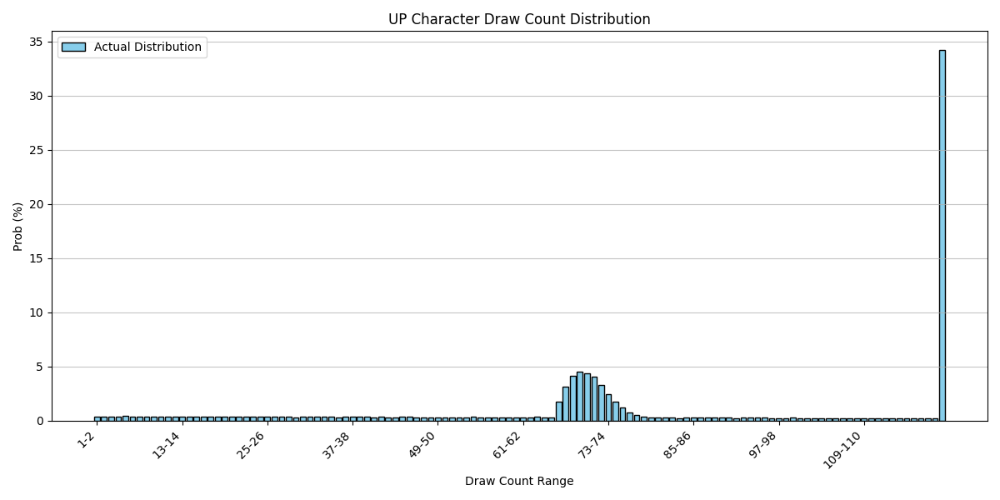
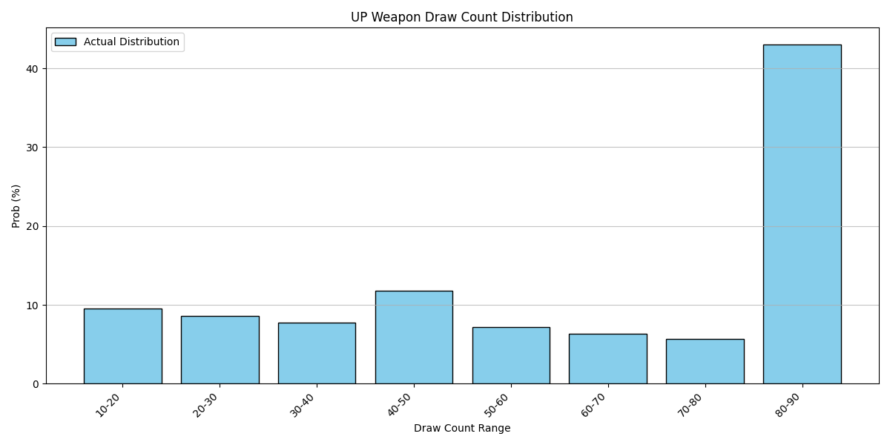
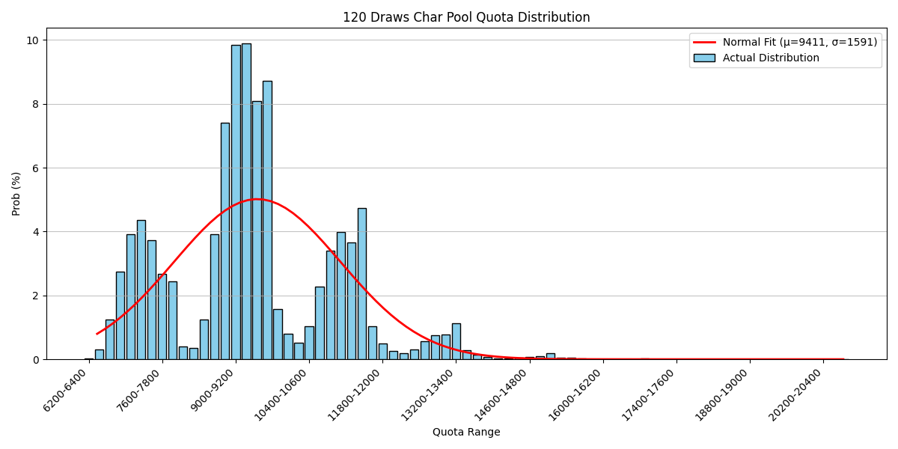
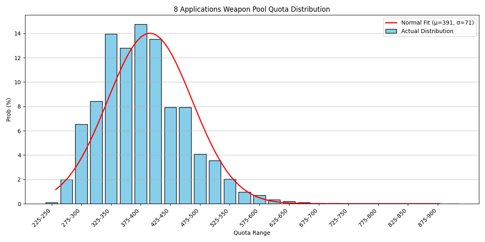
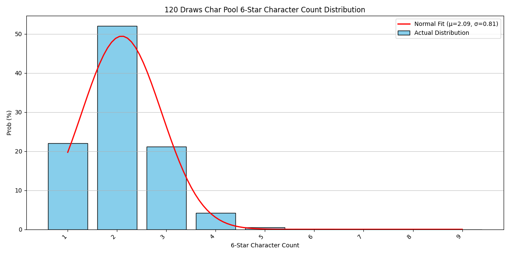
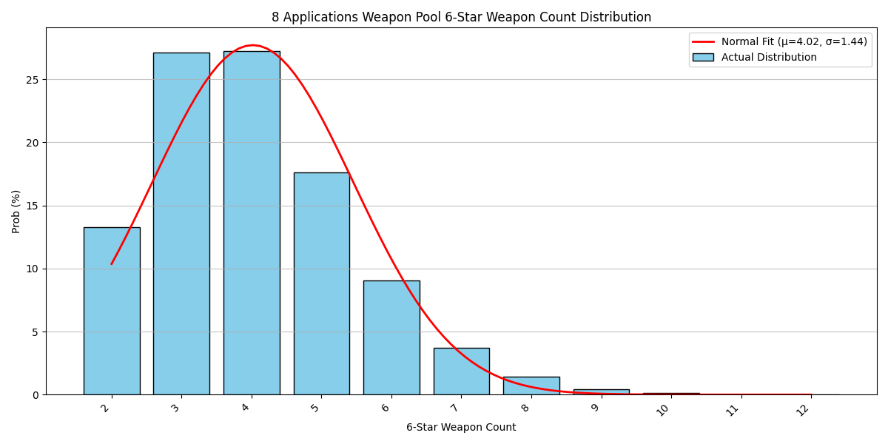

# Endfield Gacha | 终末地卡池

**文 / A**：[**中文**](README.md) | [**English**](README_en.md)

---

## Endfield Gacha

A gacha system for *Arknights: Endfield*, including but not limited to statistics and simulation.

## Table of Contents

- [Project Introduction](#project-introduction)
- [Notes](#notes)
- [Statistical Conclusions](#statistical-conclusions)
- [Updates & Plans](#updates--plans)
- [Acknowledgements](#acknowledgements)

---

## Project Introduction

### 1. Environment Requirements

- **Python** 3.10+ (developed with 3.14.2)

- Dependency Libraries:
      - matplotlib 3.10.8 (for statistical plotting)
      - rich 14.3.2 (for terminal styling)
      - tqdm 4.67.3 (for progress display)

### 2. Installation Steps

#### Clone the Repository

```bash
git clone https://github.com/ArsvineZhu/EndfieldGacha.git
cd EndfieldGacha
```

#### Install Dependencies

```bash
pip install -r requirements.txt
```

### Project Structure

```plaintext
EndfieldGacha/
├── config/                   # Configuration file directory
│   ├── char_pool.json        # Character gacha pool configuration
│   ├── constants.json        # Constant value configuration
│   ├── gacha_rules.json      # Gacha rules configuration
│   └── weapon_pool.json      # Weapon gacha pool configuration
├── pic/                      # Image storage directory
│   ├── char.png              # Original image of character gacha rules
│   ├── weapon.png            # Original image of weapon gacha rules
│   └── stats/                # Statistical result image storage directory
├── client.py                 # Console Client
├── core.py                   # Gacha System Core
└── demo.py                   # Demo and Statistics
```

---

## Notes

Some image assets are screenshots from **Arknights: Endfield**.

Original introduction to in-game gacha mechanics: [mechanics.md](doc/mechanics_en.md).

Some rules are **not detailed** in official gacha explanations. Therefore, **reasonable assumptions** have been made during development for the following parts:

### I. 10-Pull Pity Mechanism

The character banner has a rule: *“Every 10 pulls guarantees at least one 5★ or higher operator”*.
The probability distribution between 5★ and 6★ on that guaranteed pull is not specified, so two assumptions are considered:

#### (1) 5★ takes up 4★ probability; 6★ base probability unchanged (current implementation)

Example: First 10-pull on a new banner, no 5★ or higher in first 9 pulls.
10th pull distribution:

```plaintext
6★:  0.80%
5★: 91.20%
4★:  0.00%
```

Example: Mid-pull banner, no 6★ in first 68 pulls, no 5★ in previous 9 pulls.
Next pull (69th):

```plaintext
6★: 20.80%
5★: 79.20%
4★:  0.00%
```

> **Rule**: If no 6★ operator in first 65 pulls, 6★ probability increases by 5% per pull starting from pull 66, until guaranteed 6★ at pull 80 (soft pity).

#### (2) Total 5★+6★ probability = 100%, remapped proportionally (discarded)

Example: First 10-pull, no 5★+ in first 9 pulls.
10th pull:

```plaintext
6★: ~ 0.91% ← 0.8% / (0.8% + 8%)
5★: ~90.91% ← 8.0% / (0.8% + 8%)
4★:  0.00%
```

Example: No 6★ in 68 pulls, no 5★ in previous 9 pulls.
Next pull (69th):

```plaintext
6★: ~72.22% ← 20.8% / (20.8% + 8%)
5★: ~27.78% ←  8.0% / (20.8% + 8%)
4★:  0.00%
```

The second assumption clearly **does not match real gameplay experience** ~~and contradicts developer intent~~, so it is discarded.

The same first assumption applies to the weapon banner for 10-pull pity.

### II. 6★ Probability Increase (Soft Pity)

Character banner rule:
*“If no 6★ operator in first 65 pulls, 6★ probability increases by 5% per pull starting from pull 66, until guaranteed 6★ at pull 80.”*

It does not specify how 5★ and 4★ rates are distributed when 6★ rate rises. Two assumptions:

#### (1) 6★ takes up lower-rarity probabilities

Example: No 6★ in 68 pulls, 5★ already obtained in previous 9 pulls (10-pull pity not triggered).
Next pull (69th):

```plaintext
6★: 20.80%
5★:  8.00%
4★: 71.20% (truncated)
```

At higher pull counts:

```plaintext
6★: 80.80%
5★:  8.00%
4★: 11.20% (truncated)
```

Further:

```plaintext
6★: 95.80%
5★:  4.20% (truncated)
4★:  0.00% (fully truncated)
```

This assumption distorts 5★/4★ ratios at high pulls.
Without real data, I cannot verify if this matches actual in-game results.

> **Premise**: Prioritize taking 4★ probability, not 5★. 5★ fisrt? NO WAY!

#### (2) Total 5★+4★ probability = 100%, remapped proportionally (tentative)

Example: No 6★ in 68 pulls, 5★ already obtained (10-pull pity not triggered).
Next pull (69th):

```plaintext
6★:  20.80%
5★: ~ 6.38% ← 8% * (1 – 20.80%) / (8% + 91.2%)
4★: ~72.81% ← 91.2% * (1 – 20.80%) / (8% + 91.2%)
```

This preserves the 5★/4★ ratio and is more likely the actual implementation.

Without data, it is hard to confirm which is realistic. **Assumption 2 is used tentatively.**

---

## Statistical Conclusions

All results are from `demo.py` simulations, default sample size: **10K trials** unless noted.

### (1) Pulls needed to get rate-up character on a character banner

Probability distribution:


**Conclusion**: Average pulls for rate-up operator: **81.57**

- 1–65 (early 6★): 22.70%
- 66–80 (soft pity): 33.09% (~1/3)
- 81–119: 10.08%
- 120 (hard pity): 34.13% (~1/3)

~~120-pull hard pity is OFF THE CHARTS! What a monolith bar!~~

> Note: 10 free pulls from Urgent Recruitment are not used or counted.

### (2) Pulls needed to get rate-up weapon on a weapon banner

Probability distribution:


**Conclusion**: Average pulls for rate-up weapon: **55.49** (≈5–6 claims)

- 10–20: 9.62%
- 20–30: 8.60%
- 30–40: 7.72%
- 40–50: 11.95% *
- 50–60: 7.12%
- 60–70: 6.31%
- 70–80: 5.71%
- 80–90: 42.95% *

> \* No 6★ weapon in 3 claims → guaranteed 6★ on 4th claim
> \* No rate-up weapon in 7 claims → guaranteed rate-up on 8th claim

### (3) Expected pulls for rate-up character (stopping at soft pity: 80 pulls)

Probability distribution:
")

**Conclusion**: Average pulls: **54.75**

> Note: 10 free pulls from Urgent Recruitment not counted.

### (4) Expected pulls for rate-up character (stopping at 119 pulls)

Probability distribution:
")

**Conclusion**: Average pulls: **61.46**

> Note: 10 free pulls from Urgent Recruitment not counted.

### (5) Arsenal Quota from 120 pulls on character banner

Probability distribution:


**Conclusion**: Arsenal Quota approximates a normal distribution.
Mean: **9411**, Standard deviation: **1591**

> Note: 10 free pulls from Urgent Recruitment not counted.

### (6) Integrated Quota from 8 weapon banner claims

Probability distribution:


**Conclusion**: Integrated Quota approximates a normal distribution.
Mean: **391**, Standard deviation: **71**

### (7) Number & rarity distribution of operators from 120 character pulls

Probability distribution:


**Conclusion**: 6★ operator count approximates normal distribution.
Mean: **2.09**, Standard deviation: **0.80**

Rarity rates:

- 4★: 84.98%
- 5★: 13.27%
- 6★: 1.74% (rate-up = 0.87%)

> Note: 10 free pulls from Urgent Recruitment not counted.

### (8) Number & rarity distribution of weapons from 8 weapon claims

Probability distribution:


**Conclusion**: 6★ weapon count approximates normal distribution.
Mean: **4.02**, Standard deviation: **1.44**

Rarity rates:

- 4★: 79.11%
- 5★: 15.87%
- 6★: 5.02% (rate-up = 1.255%)

---

## Updates & Plans

This project is developed as a hobby. My technical ability is limited—please feel free to point out errors.

### Changelog

#### 2026‑02‑09 Version 1.0.0 Stable release

### Future Plans

#### Console Client Realism Update

- Support reading historical gacha records
- Support importing owned operators
- Support tokens from duplicate operators, exchangeable for **Guarantee Quota** or **Endpoint Quota**

---

## Acknowledgements

- **Shanghai Hypergryph Network Technology Co., Ltd.**
- **Arknights: Endfield**
- ~~Who gave me bad ideas,~~ Rosemary stan & white-haired catgirl: **宁宁(Ning-ning)**
- Veteran Arknights friends who discussed with me: **LoyaLTY**
- All developers and content creators who supported and inspired me

> Note: Listed in no particular order.

---

> Note: Parts of this document and code may be AI-generated.
