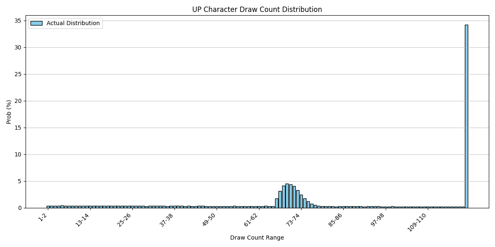
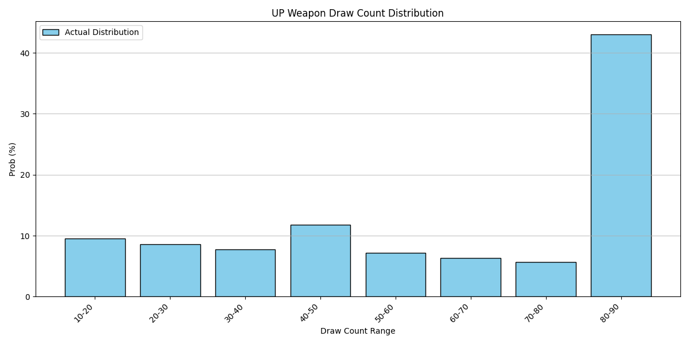
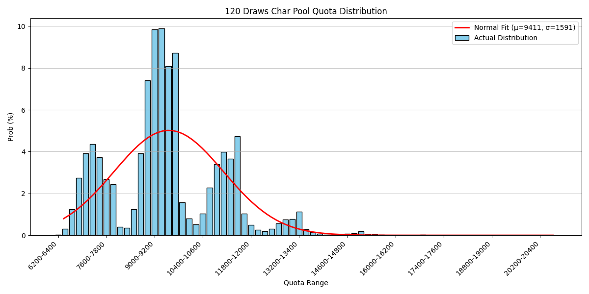
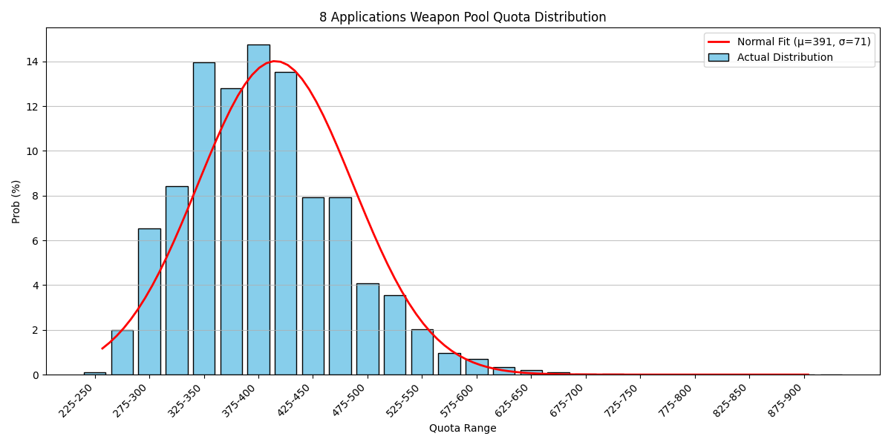
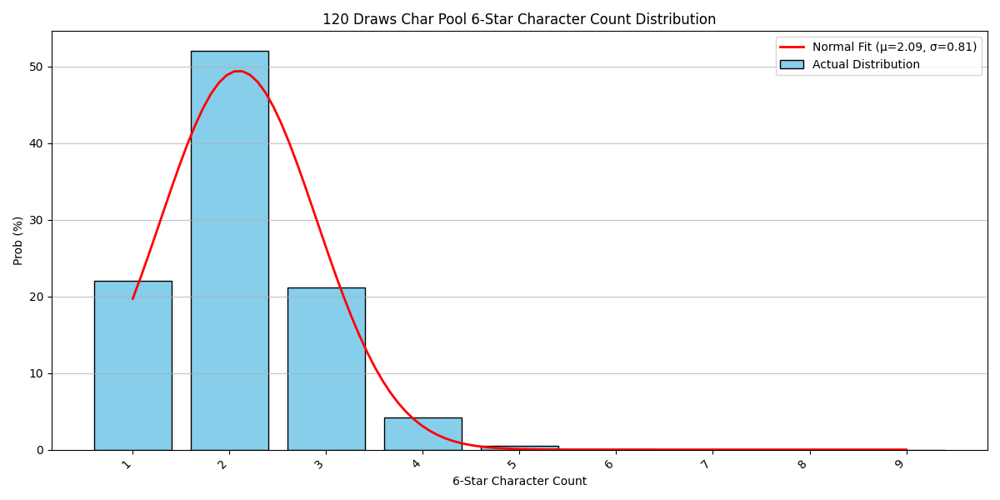
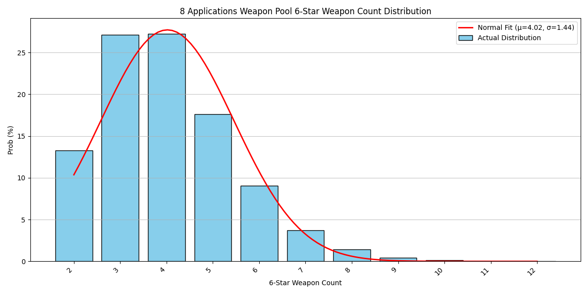
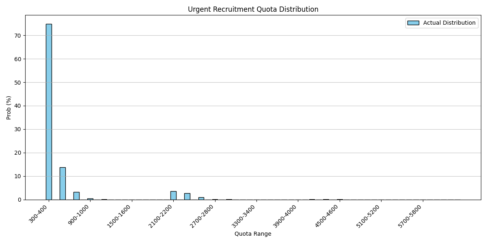

# Endfield Gacha | 终末地卡池

**文 / A**：[**中文**](README.md) | [**English**](README_en.md)

---

## Endfield Gacha

A gacha system for *Arknights: Endfield*, including but not limited to statistics and simulation of **Chartered Headhunting** and **Arsenal Issue**.

## Table of Contents

- [Project Introduction](#project-introduction)
- [Notes](#notes)
- [Statistical Conclusions](#statistical-conclusions)
- [Updates & Plans](#updates--plans)
- [Acknowledgements](#acknowledgements)

---

## Project Introduction

### 1. Environment Requirements

- **Python** 3.10+ (developed with 3.14.2)

- Dependency Libraries (see requirements.txt for complete list):
      - Flask, Flask-Cors, waitress (Web service)
      - numpy (core computation)
      - rich (terminal styling and progress display)
      - matplotlib, pillow, scipy (statistical plotting and analysis)
      - tqdm (progress display)

### 2. Installation Steps

#### Clone the Repository

```bash
git clone https://github.com/ArsvineZhu/EndfieldGacha.git
cd EndfieldGacha
```

#### Install Dependencies

```bash
pip install -r requirements.txt
```

### Project Structure

```plaintext
EndfieldGacha/
├── configs/                  # Configuration file directory (multiple config sets)
│   ├── config_1/            # Configuration set 1
│   │   ├── char_pool.json   # Operator gacha pool configuration
│   │   ├── weapon_pool.json # Weapon gacha pool configuration
│   │   ├── gacha_rules.json # Gacha rules configuration
│   │   └── constants.json   # Global constant configuration
│   ├── config_2/ ... config_7/ # Other configuration sets
│   ├── arrangement          # Default configuration order
│   └── arrange1             # Scheduler-specific configuration order
├── app/                     # Web application directory
│   ├── templates/          # HTML template files
│   ├── static/             # Compressed static resources
│   └── utils/compress.py   # Resource compression tool
├── core.py                 # Core gacha logic
├── server.py               # Web service
├── scheduler.py            # Strategy scheduling system
├── demo.py                 # Demo and statistics tools
├── evaluation.py           # Strategy evaluation scripts
├── examination.py          # Probability distribution verification
├── start.ps1               # Windows startup script
├── users/                  # User data storage
├── pic/                    # Image resource directory
└── doc/                    # Documentation directory
```

---

## Notes

Some image assets are screenshots from **Arknights: Endfield**.

Original introduction to in-game gacha mechanics: [mechanics.md](doc/mechanics_en.md).

Some rules are **not detailed** in official explanations of Chartered Headhunting and Arsenal Issue. Therefore, **reasonable assumptions** have been made during development for the following parts:

### I. 10-Pull Pity Mechanism

The Chartered Headhunting banner has a rule: *“Every 10 headhunting attempts guarantee at least one 5★ or higher Operator”*.
The probability distribution between 5★ and 6★ on that guaranteed attempt is not specified, so two assumptions are considered:

#### (1) 5★ takes up 4★ probability; 6★ base probability unchanged (current implementation)

Example: First 10-headhunting attempt on a new Chartered Headhunting banner, no 5★ or higher in first 9 attempts.
10th attempt distribution:

```plaintext
6★:  0.80%
5★: 91.20%
4★:  0.00%
```

Example: Mid-banner Chartered Headhunting, no 6★ in first 68 attempts, no 5★ in previous 9 attempts.
Next attempt (69th):

```plaintext
6★: 20.80%
5★: 79.20%
4★:  0.00%
```

> **Rule**: If no 6★ Operator in first 65 headhunting attempts, 6★ probability increases by 5% per attempt starting from attempt 66, until guaranteed 6★ at attempt 80 (Soft Pity).

#### (2) Total 5★+6★ probability = 100%, remapped proportionally (discarded)

Example: First 10-headhunting attempt on a new Chartered Headhunting banner, no 5★+ in first 9 attempts.
10th attempt:

```plaintext
6★: ~ 0.91% ← 0.8% / (0.8% + 8%)
5★: ~90.91% ← 8.0% / (0.8% + 8%)
4★:  0.00%
```

Example: Mid-banner Chartered Headhunting, no 6★ in 68 attempts, no 5★ in previous 9 attempts.
Next attempt (69th):

```plaintext
6★: ~72.22% ← 20.8% / (20.8% + 8%)
5★: ~27.78% ←  8.0% / (20.8% + 8%)
4★:  0.00%
```

The second assumption clearly **does not match real gameplay experience** ~~and contradicts developer intent~~, so it is discarded.

The same first assumption applies to the Arsenal Issue banner for 10-Pull Pity.

### II. 6★ Probability Increase (Soft Pity)

Chartered Headhunting rule:
*“If no 6★ Operator in first 65 headhunting attempts, 6★ probability increases by 5% per attempt starting from attempt 66, until guaranteed 6★ at attempt 80.”*

It does not specify how 5★ and 4★ rates are distributed when 6★ rate rises. Two assumptions:

#### (1) 6★ takes up lower-rarity probabilities

Example: Mid-banner Chartered Headhunting, no 6★ in 68 attempts, 5★ already obtained in previous 9 attempts (10-Pull Pity not triggered).
Next attempt (69th):

```plaintext
6★: 20.80%
5★:  8.00%
4★: 71.20% (truncated)
```

At higher pull counts:

```plaintext
6★: 80.80%
5★:  8.00%
4★: 11.20% (truncated)
```

Further:

```plaintext
6★: 95.80%
5★:  4.20% (truncated)
4★:  0.00% (fully truncated)
```

This assumption distorts 5★/4★ ratios at high attempts.
Without real data, I cannot verify if this matches actual in-game results.

> **Premise**: Prioritize taking 4★ probability, not 5★. 5★ fisrt? NO WAY!

#### (2) Total 5★+4★ probability = 100%, remapped proportionally (tentative)

Example: Mid-banner Chartered Headhunting, no 6★ in 68 attempts, 5★ already obtained (10-Pull Pity not triggered).
Next attempt (69th):

```plaintext
6★:  20.80%
5★: ~ 6.38% ← 8% * (1 – 20.80%) / (8% + 91.2%)
4★: ~72.81% ← 91.2% * (1 – 20.80%) / (8% + 91.2%)
```

This preserves the 5★/4★ ratio and is more likely the actual implementation.

Without data, it is hard to confirm which is realistic. **Assumption 2 is used tentatively.**

---

## Statistical Conclusions

All results are from `demo.py` simulations, default sample size: **100K trials** unless noted.

### (1) Headhunting attempts needed to get Rate-UP Operator on a Chartered Headhunting banner

Probability distribution:


**Conclusion**: Average headhunting attempts for Rate-UP Operator: **81.57**

- 1–65 (Early 6★): 22.70%
- 66–80 (Soft Pity): 33.09% (~1/3)
- 81–119: 10.08%
- 120 (Hard Pity): 34.13% (~1/3)

~~120-attempt Hard Pity is OFF THE CHARTS! What a monolith bar!~~

> Note: 10 free headhunting attempts (10-pull) from Urgent Recruitment are not used or counted.

### (2) Arsenal Issue attempts (1 attempt = 10 weapons) needed to get Rate-UP Weapon on an Arsenal Issue banner

Probability distribution:


**Conclusion**: Average Arsenal Issue attempts for Rate-UP Weapon: **55.49** (≈5–6 issue attempts)

- 10–20: 9.62%
- 20–30: 8.60%
- 30–40: 7.72%
- 40–50: 11.95% *
- 50–60: 7.12%
- 60–70: 6.31%
- 70–80: 5.71%
- 80–90: 42.95% *

> \* No 6★ Weapon in 3 Arsenal Issue attempts → guaranteed 6★ on 4th attempt
> \* No Rate-UP Weapon in 7 Arsenal Issue attempts → guaranteed Rate-UP on 8th attempt

### (3) Expected headhunting attempts for Rate-UP Operator (stopping at Soft Pity: 80 attempts)

Probability distribution:
")

**Conclusion**: Average pulls: **54.75**

> Note: 10 free headhunting attempts (10-pull) from Urgent Recruitment not counted.

### (4) Expected headhunting attempts for Rate-UP Operator (stopping at 119 attempts)

Probability distribution:
")

**Conclusion**: Average attempts: **61.46**

> Note: 10 free headhunting attempts (10-pull) from Urgent Recruitment not counted.

### (5) Arsenal Ticket from 120 headhunting attempts on Chartered Headhunting banner

Probability distribution:


**Conclusion**: Arsenal Ticket approximates a normal distribution.
Mean: **9411**, Standard deviation: **1591**

> Note: 10 free headhunting attempts (10-pull) from Urgent Recruitment not counted.

### (6) AIC Quota from 8 Arsenal Issue attempts

Probability distribution:


**Conclusion**: AIC Quota approximates a normal distribution.
Mean: **391**, Standard deviation: **71**

### (7) Number & rarity distribution of Operators from 120 Chartered Headhunting attempts

Probability distribution:


**Conclusion**: 6★ Operator count approximates normal distribution.
Mean: **2.09**, Standard deviation: **0.80**

Rarity rates:

- 4★: 84.98%
- 5★: 13.27%
- 6★: 1.74% (Rate-UP = 0.87%)

> Note: 10 free headhunting attempts (10-pull) from Urgent Recruitment not counted.

### (8) Number & rarity distribution of Weapons from 8 Arsenal Issue attempts

Probability distribution:


**Conclusion**: 6★ Weapon count approximates normal distribution.
Mean: **4.02**, Standard deviation: **1.44**

Rarity rates:

- 4★: 79.11%
- 5★: 15.87%
- 6★: 5.02% (Rate-UP = 1.255%)

### (9) Arsenal Ticket Distribution from 10 Headhunting Attempts of Urgent Recruitment

Probability distribution:


**Conclusion**: Urgent Recruitment 10-headhunt attempt Arsenal Ticket mean: **571**

---

## Changelog

### 2026‑02‑09 Version 1.0.0 Stable release

- Initial version release with basic gacha functionality
- Character and Weapon pool simulation support
- Console client interface

### 2026-02-24 Version 1.1.0 Gacha Core Tweaks

- Optimize the **random number generation** mechanism and enable the **reproducibility** of gacha draw outcomes.
- Added statistics in `demo.py`: "The number of pulls required for the current UP 6-star character to reach **max potential** (number of drawn characters + number of tokens = 6)"
- Added **probability verification** in `examination.py`

### 2026-03-01 Version 2.0.0 Web Client Release

- Flask Web server implementation with complete user management system
- Web interface accessible at <http://localhost:5000>
- User data persistence storage (`users/` directory)
- Full functionality including character/weapon gacha, recharge, exchange, and history records

### 2026-03-05 Version 2.1.0 Documentation System & Architecture Optimization

- **Documentation System Overhaul**:
  - Rewrote AGENTS.md as an AI assistant-specific document with structured project indexing
  - Enhanced README.md with technical architecture details, quick start guide, and developer guide
  - Established a complete document reference system for AI assistants and developers
- **System Architecture Optimization**:
  - Clarified that no new gacha pool types will be added (only Character and Weapon pools)
  - Improved documentation for the strategy scheduling system (`scheduler.py`)
  - Optimized configuration file structure documentation
- **Code Quality Improvements**:
  - Unified document version identification (2.0.0 → 2.1.0)
  - Enhanced troubleshooting and important notes
  - Updated contribution guidelines and development standards

### Future Development Directions

#### Web Client Enhancement

- Support reading historical gacha records
- Support importing owned Operators
- Support Tokens from duplicate Operators, exchangeable for **Bond Quota** or **Endpoint Quota**

#### Statistical Analysis Expansion

- Integrate more data visualization options
- Add data export functionality (CSV, Excel formats)

#### Performance Optimization

- Optimize large-scale batch simulation performance
- Consider database support to improve user data access efficiency

---

## Acknowledgements

- Shanghai Hypergryph Network Technology Co., Ltd.
- *Arknights: Endfield*
- ~~Who gave me bad ideas,~~ Rosemary stan & white-haired catgirl: **Ning-ning (宁宁)**
- Veteran Arknights friends who discussed with me: **LoyaLTY**
- All developers and content creators who supported and inspired me

> Note: Listed in no particular order.

---

> Note: Parts of this document and code may be AI-generated. This document is translated based on the Chinese version and the comparison of in-game proper nouns; please refer to the Chinese version as the authoritative source. Due to the difficulty of cross-reference translation, the content of this English version may lag behind the latest updates of the Chinese version.
