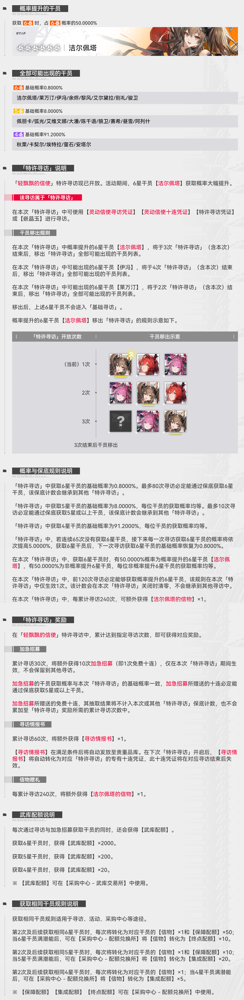
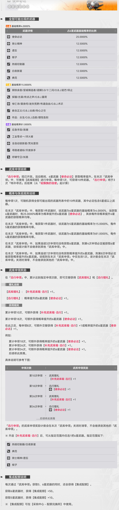

# Endfield Gacha Mechanisms Official Introduction | 终末地卡池机制官方介绍

**文 / A**：[**中文**](mechanics.md "中文版卡池机制文档") | [**English**](mechanics_en.md "English version gacha mechanisms document")

---

[Chartered Headhunting (Char Gacha)](#chartered-headhunting-char-gacha)
[Arsenal Issue (Weapon Gacha)](#arsenal-issue-weapon-gacha)
[Duplicate Acquisition Rules](#duplicate-acquisition-rules)
[Resource Exchange Rules](#resource-exchange-rules)
[Official Gacha Screenshots](#official-gacha-screenshots)

---

## Chartered Headhunting (Char Gacha)

### Basic Rules

Chartered Headhunting uses **single pull** mode, each pull consumes 1 `Chartered HH Permit` or 75 `Oroberyl`.

### Banner Rotation & Operator Removal Rules

- Each Chartered Headhunting banner runs for a fixed period, featuring 1 rate-up 6★ operator
- 6★ operators will be removed from the banner after the specified number of banner rotations, and will not enter the Standard Recruitment pool
- Rate-up operators are usually removed after 3 banner rotations, other 6★ operators are removed after 3-5 rotations

#### 6★ Operator List (Current Banner: 2nd post-launch)

| Operator Name | Type | Removal After | Rate-up Probability |
|---------------|------|---------------|---------------------|
| Gilberta（洁尔佩塔） | Current Rate-up | After 3 banners | 50% of all 6★ drops |
| Laevatain（莱万汀） | Previous Rate-up | After 3 banners | Split evenly among remaining 50% |
| Yvonne | Next Rate-up | After 4 banners | Split evenly among remaining 50% |
| Ember | Permanent | After 5 banners | Split evenly among remaining 50% |
| Li Feng | Permanent | After 5 banners | Split evenly among remaining 50% |
| Aldera | Permanent | After 5 banners | Split evenly among remaining 50% |
| Bieli | Permanent | After 5 banners | Split evenly among remaining 50% |
| Jun Wei | Permanent | After 5 banners | Split evenly among remaining 50% |

### Probability Rules

Initial probability distribution (Pull 1-65, no pity triggered):

- 6★ Operator: 0.8%
- 5★ Operator: 8%
- 4★ Operator: 91.2%
- Operators of the same rarity have equal pull probability
- Rate-up operator accounts for 50% of all 6★ operator drop rates

### Pity Mechanism

#### 1. 5★ Pity (Cross-banner inherited)

Every 10 pulls guarantees at least 1 5★ or higher operator:

- If no 5★+ operator obtained in 9 consecutive pulls, the 10th pull will definitely be 5★+
- Pity counter is inherited across all Chartered Headhunting banners

#### 2. 6★ Soft Pity (Probability Increase, Cross-banner inherited)

- If no 6★ operator obtained in first 65 pulls, 6★ probability increases by 5% per pull starting from pull 66
- 6★ Probability = Base Probability + (Current Pull - 65) * 5%
- When probability increases, 4★ probability is reduced first, 5★ probability remains 8% unchanged
- Pity counter is inherited across all Chartered Headhunting banners

#### 3. 6★ Hard Pity (Cross-banner inherited)
- Maximum 80 pulls guarantee a 6★ operator
- 6★ probability increases to 100% at pull 80
- Pity counter is inherited across all Chartered Headhunting banners

#### 4. Rate-up Operator Pity (Current banner only)

- First 120 pulls guarantee the featured 6★ rate-up operator
- This rule only applies once per banner, counter resets when the banner ends, not inherited to other banners

### Accumulated Reward Rules

Extra rewards when accumulated pulls reach specified count:

| Accumulated Pulls | Reward | Description |
|-------------------|--------|-------------|
| 30 pulls | ×1 Urgent Recruitment | Free 10-pull for current banner only, not counted towards pity or accumulated pulls |
| 60 pulls | ×1 Headhunting Dossier | Automatically converts to 10-pull ticket for the next Chartered Headhunting banner |
| Every 240 pulls | ×1 Rate-up Operator Token | Can be obtained repeatedly, used to increase operator potential |

#### Urgent Recruitment Notes

- Same probability as current banner, guarantees at least 1 5★+ operator
- Pull results do not count towards any pity counter or accumulated pull count
- Only valid for current banner, will not carry over to other banners

#### Headhunting Dossier Notes

- Automatically added to inventory, converts to exclusive 10-pull ticket when next Chartered Headhunting banner starts
- Ticket expires when the corresponding banner ends

### Quota Reward Rules

Each pull rewards Arsenal Tickets (can be used for Arsenal Issue):

- 6★ Operator: 2000 Arsenal Tickets
- 5★ Operator: 200 Arsenal Tickets
- 4★ Operator: 20 Arsenal Tickets

---

## Arsenal Issue (Weapon Gacha)

### Basic Rules

Arsenal Issue uses **claim mode**, each claim is 10 pulls, consumes 1980 `Arsenal Tickets`.

- Each Arsenal Issue banner ends when the corresponding Chartered Headhunting banner ends
- Each banner features 1 rate-up 6★ weapon, accounting for 25% of all 6★ weapon drop rates

### Probability Rules

Initial probability distribution (no pity triggered):

- 6★ Weapon: 4%
- 5★ Weapon: 15%
- 4★ Weapon: 81%
- Weapons of the same rarity have equal pull probability
- Rate-up weapon accounts for 25% of all 6★ weapon drop rates

### Pity Mechanism

#### 1. Single Claim Pity

Each claim (10 pulls) guarantees at least 1 5★ or higher weapon:

- If first 9 items are all 4★ weapons, the 10th item will be replaced with 5★+ weapon

#### 2. 6★ Pity (Current banner only)

- Every 4 claims guarantee at least 1 6★ weapon
- If no 6★ weapon obtained in 3 consecutive claims, the last item of the 4th claim will definitely be 6★ weapon
- Counter resets when banner ends, not inherited to other banners

#### 3. Rate-up Weapon Pity (Current banner only)

- Every 8 claims guarantee at least 1 featured 6★ rate-up weapon
- If no UP 6★ weapon obtained in 7 consecutive claims, the last item of the 8th claim will definitely be the UP weapon
- This rule only applies once per banner, counter resets when the banner ends

### Pity Priority

Arsenal Issue pity trigger priority from highest to lowest:
> Rate-up Weapon Pity > 6★ Pity > 5★ Pity

### Accumulated Reward Rules

Extra rewards when accumulated claims reach specified count, alternating between two reward types:

| Accumulated Claims | Reward | Description |
|-------------------|--------|-------------|
| 10 claims | ×1 Arsenal Supply Crate | Select any 1 6★ weapon from the specified range |
| 18 claims | ×1 Rate-up Weapon | Directly obtain the featured 6★ rate-up weapon |
| Every 8 claims thereafter | Alternate between the two rewards | Cyclical distribution, valid for current banner only |

### Quota Reward Rules

Each claim rewards AIC Quota（集成配额）:

- 6★ Weapon: 50 AIC Quota（集成配额）
- 5★ Weapon: 10 AIC Quota（集成配额）
- 4★ Weapon: 1 AIC Quota（集成配额）

---

## Duplicate Acquisition Rules

### Operator Duplicate Acquisition

Applies to all operator acquisition methods (recruitment, events, exchange, etc.):

| Rarity | Duplicate Reward | Exchange after Max Potential |
|--------|------------------|-------------------------------|
| 6★ | ×1 Operator Token + ×50 Bond Quota（保障配额） | Tokens can be exchanged for ×10 Endpoint Quota（终点配额） |
| 5★ | ×1 Operator Token + ×10 Bond Quota（保障配额） | Tokens can be exchanged for ×20 AIC Quota（集成配额） |
| 4★ | ×1 Operator Token | Tokens can be exchanged for ×5 AIC Quota（集成配额） |

### Weapon Duplicate Acquisition

Applies to all weapon acquisition methods (claim, events, exchange, etc.):

- Duplicate weapons automatically convert to corresponding amount of AIC Quota（集成配额）

---

## Resource Exchange Rules

| Resource | Exchange Rate | Usage |
|----------|---------------|-------|
| Origeometry | 1:75 Oroberyl / 1:25 Arsenal Tickets | Premium currency, can be exchanged for recruitment/claim resources |
| Oroberyl | 75:1 Chartered HH Permit | Used for Chartered Headhunting |
| Arsenal Tickets | 1980:1 Arsenal Issue | Used for Arsenal Issue |
| Bond Quota（保障配额） / AIC Quota（集成配额） / Endpoint Quota（终点配额） | Exchange for various materials in Quota Exchange | Obtained from duplicate operators/weapons |

---

## Official Gacha Screenshots

### Chartered Headhunting Screenshot (2026-2-9)

### Arsenal Issue Screenshot (2026-2-9)

---

## Implementation Notes

- All probability calculations use `Decimal` high-precision type to avoid floating-point errors
- Random number generation uses batch pre-generation mechanism, supports seed reproduction function
- Pity judgment order is strictly executed according to priority to ensure compliance with game design expectations
- ✅ Implemented: Core gacha logic, all pity mechanisms, quota rewards, accumulated rewards
- ⏳ Planned: Duplicate operator processing, token system, resource exchange features
